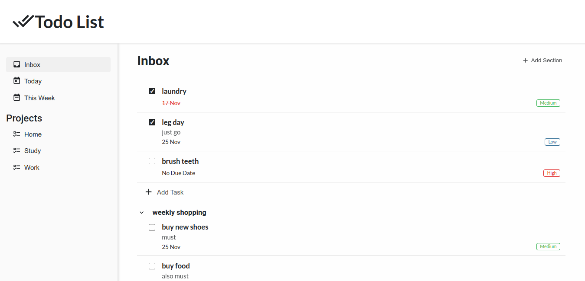
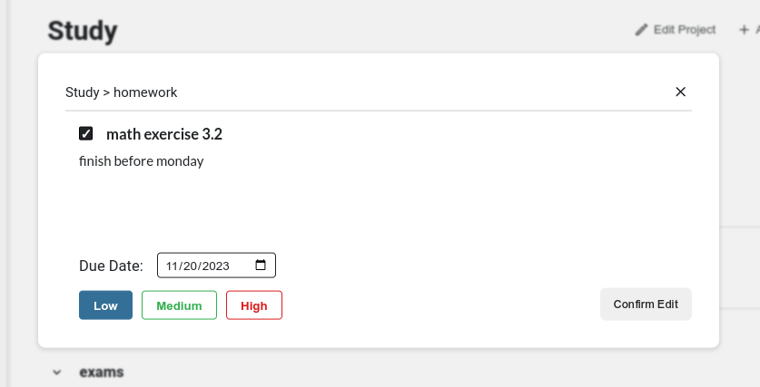

# To-Do List

A task manager app made using HTML, CSS and JavaScript.

A live preview of the app can be found [here](https://sh4dman23.github.io/todo-list).

## Features
### Projects
Besides Inbox, users are able to create custom projects where they can save their To-Do items. Each project allows
users to create items either outside or inside sections created by them.

### Sections
Users can create sections where they can group together multiple To-Do items and thus, keep their projects organized.
Hovering over a section will give users the option to delete them.

### To-Do Items
Users can create To-Do items in Inbox or in their own projects and are able to set the following properties on them:

1. A title
2. A description (optional)
3. A due date (optional), with items not having a due dates showing 'No Due Date' in their date section
4. A priority ('Low' / 'Medium' / 'High') (required), which is 'Low' by default

Hovering over a To-Do item will give users the options to either edit or delete them.

### User Data Storage
All user data in this project is stored in cookies. This was also my first time using localStorage.

*Note*: This project may get an update in the future when I stumble across Firebase in my course, where I will use
it to store user data online.

## License
This project is licensed under MIT License. See [LICENSE](./LICENSE) for more information.

## Acknowlegments
- To-Do List was done as a project for [The Odin Project](https://www.theodinproject.com) course.
- All SVG used in this project are from [Pictogrammers](https://pictogrammers.com/).